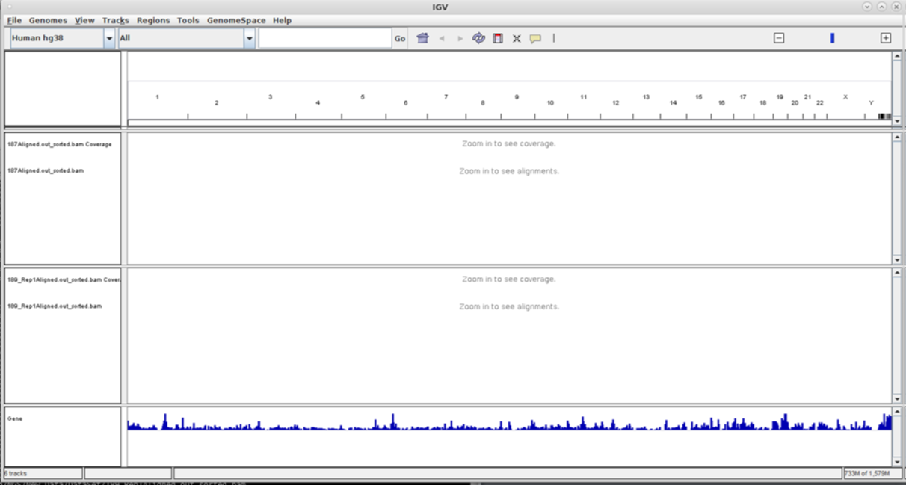
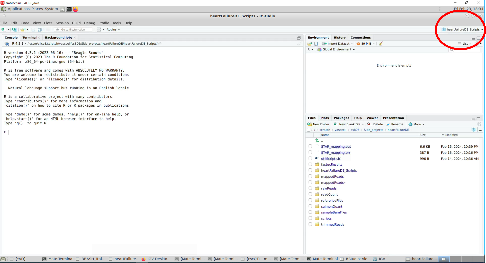

```{r setup, include=FALSE}
knitr::opts_chunk$set(echo = TRUE)

colorize <- function(x, color) {
  if (knitr::is_latex_output()) {
    sprintf("\\textcolor{%s}{%s}", color, x)
  } else if (knitr::is_html_output()) {
    sprintf("<span style='color: %s;'>%s</span>", color,
      x)
  } else x
}

```

### Summary

During practical sessions over the next two days, we will take an Illumina paired end dataset and perform the following steps:

-   data quality control

-   mapping to a reference genome

-   read counting and quantification

-   differential expression analyses

-   reproducible results reporting with Rmarkdown

### Use of this handbook

In this handbook, instructions appear as plain text while `commands have light grey backgrounds`. To run a command, type or paste it on the terminal and press the Enter key on the keyboard. Command arguments that is enclosed in pointy brackets e.g. `<replaceThis>` should be replaced with the right argument before the command is run.

Occasionally, you may see the ampersand sign, `&`, at the end of a command. The purpose is to run the command in background and leave the terminal free and allowing you to continue to use it.

Very long commands are broken into several lines by adding the backslash `\` at the end of the line in order to fit the commands on the page.

### Workspace setup

We will be working in the SCRATCH area of the University of Leicester High Performance Computer, ALICE. You can access your own scratch area by running the following command on the terminal.

```{bash, eval = F}
cd $SCRATCHDIR
```

The command:

```{bash, eval = F}
pwd
```

will display the full path to the current directory. Please check to make sure you are working in the scratch area.

Create a directory named RNAseqCourse in your scratch area and change into that directory by running the following commands:

```{bash, eval = F}
mkdir RNAseqCourse
cd RNAseqCourse
```

This directory will serve as our working directory throughout the course. The rest of the commands in this handbook should be run from this directory.

A number of the bioinformatic software we will be using are already installed on ALICE. We can be load the software in our own environment using the module command. For example, the following command will make **plink** software available for our use in the terminal where it is run.

```{bash, eval = F}
module load plink
```

### Practical one - Introduction to Unix and BASH

The instructions for this practical can be found at <https://github.com/krother/bash_tutorial/blob/master/README.md> A printed version of this instruction is also available.

To get started, copy the exercises by running the the following command:

```{bash, eval = F}
cp -r /rfs/BBASH/Teaching/RNASEQ_MARCH2024/RNAseqCourse/unixPractical/ .
```

### RNA-Seq dataset

The data we will be using comes from a 2015 publication by Liu and colleagues ([https://goo.gl/SvIyhx](https://www.sciencedirect.com/science/article/pii/S0888754314002687){.uri}) where they used RNA-Seq data to investigate and identify gene expression signatures of heart failure. The GEO accession number for the complete data set is GSE57345. The RNA-Seq study involved 6 subjects: 3 healthy controls and 3 ischemic heart disease patients, i.e. 2 groups with 3 biological replicates each. For the purpose of this practical the samples are labelled as follows:

-   Healthy control replicate 1 = HC1

-   Healthy control replicate 2 = HC2

-   Healthy control replicate 3 = HC3

-   Ischemic heart disease replicate 1 = IHD1

-   Ischemic heart disease replicate 2 = IHD2

-   Ischemic heart disease replicate 3 = IHD3

The RNA-Seq paired end fastq data files from GEO accession GSE57345 along with the complete set of additional data and files required to complete this practical session are contained at the following location on ALICE:

### Getting the data

```{bash, eval = F}
cp -r /rfs/BBASH/Teaching/RNASEQ_MARCH2024/RNAseqCourse/courseMaterials.zip .
unzip courseMaterials.zip
```
These commands will take a while to complete.

### Practical two - Data QC

#### Assess the quality of the data using FastQC

FastQC is a quality control tool for high throughput sequence data. More details about FastQC can be found at <https://www.bioinformatics.babraham.ac.uk/projects/fastqc/>

To keep things nice and tidy create a output directory where the results from fastQC analyes will be stored using the following command:

```{bash, eval = F}
mkdir fastqcResults 
```

Use the module command to load fastQC in your environment.

```{bash, eval = F}
module load fastqc/0.12.1
mkdir fastqcResults 
```

You can launch FastQC with a graphical interactive interface as follows:

```{bash, eval = F}
fastqc &
```

and upload your fastq files by using the File tab. Use the file tabs to save results from this interactive session in the fastqcResults directory.

Alternatively, you can use the command line interface as follows:

```{bash, eval = F}
fastqc rawReads/<fastq_input_file> -o fastqcResults

# Where
# -o path to output directory
```

This will produce a zipped report and a html file. The html report can be viewed on a web browser by running the command:

```{bash, eval = F}
gio open fastqcResults/<fastq_input_file.html>
```

Work your way through the analysis modules on the left hand side of the FastQC window/html, using the [FastQC documentation](https://www.bioinformatics.babraham.ac.uk/projects/fastqc/Help/), familiarize yourself with what each module is showing. Pay particular attention to the modules in the list below as they will help direct the downstream trimming and adapter removal steps:

-   Basic Statistics

-   Per Base Sequence Quality

-   Per Sequence Quality Scores

-   Overrepresented Sequences

-   Adapter content

`r colorize(" Questions:", "blue")`

-   `r colorize("What is the total number of sequences in each of the paired end fastq files?", "blue")`

-   `r colorize("What type of encoding is used in the fastq files?", "blue")`

-   `r colorize("What is the read length of the sequences in the fastq files?", "blue")`

-   `r colorize("Are there issues with the data?", "blue")`

#### Trim poor quality reads and remove adapters

We will use the software bbduk to perform quality control on the raw sequence reads. bbduk is part of the BBTools suite of bioinformatics tools. More details about bbduk is available at <https://jgi.doe.gov/data-and-tools/software-tools/bbtools/>

To begin we load the required module and create a directory to store quality controlled reads.

```{bash, eval = F}
module load bbmap/39.01-pbxungf
mkdir trimmedReads
```

Next we run the following command to QC the Healthy control replicate 1 (HC1) sample.

```{bash, eval = F}
bbduk.sh -Xmx1g \
  in1=rawReads/HC1_1.fastq.gz \
  in2=rawReads/HC1_2.fastq.gz \
  out1=trimmedReads/HC1_trimmed_1.fastq.gz  \
  out2=trimmedReads/HC1_trimmed_2.fastq.gz \
  ktrim=r  ref=referenceFiles/adapters.fa k=27 \
  hdist=1 mink=8 minlen=70 qtrim=rl trimq=20 tbo tpe overwrite=t

# Where
# -Xmx1g sets memory usage to 1 gigabyte
# in1 the forward reads of your raw paired end dataset
# in2 the reverse reads of your raw paired end dataset
# out1 the forward reads of the trimmed dataset
# out2 the reverse reads of the trimmed dataset
# ktrim trim using kmers (ie remove specified sequences such as adapters)
# ref sequences to match using ktrim
# hdist hamming distance – number of mismatches allowed with ktrim
# k kmer length to use with ktrim
# mink minimum kmer length when trimming at ends of reads
# minlen discard trimmed reads shorter than this
# qtrim trim on quality score. rl = trim from both 5’ (left) and 3’ (right) ends.
# trimq trim bases below this quality score.
# tbo trim by overlap – trim adapters based on where pairs overlap.
# tpe trim pairs equally – when kmer trimming
# overwrite if output files already exist, set to ‘t’ to overwrite.
```

`r colorize(" Question: What percentage of reads was removed?", "blue")`

`r colorize(" Question: What percentage of reads is removed if bbduk is run with minlen=50?", "blue")`

Use fastQC to assess the quality controlled read files. It will be will helpful to also load the raw read files alongside the quality controlled files.

`r colorize(" Question: How has the QC process affected the fastQC modules we are interested in the QC'ed reads?", "blue")`

We will use a `for` loop to QC the rest of the samples. Loops are useful when performing the same task on multiple files.

```{bash, eval = F}

declare -a samples=("HC1" "HC2" "HC3" "IHD1" "IHD2" "IHD3")

for id in ${samples[@]}; do
        bbduk.sh -Xmx1g \
        in1=rawReads/${id}_1.fastq.gz \
        in2=rawReads/${id}_2.fastq.gz \
        out1=trimmedReads/${id}_trimmed_1.fastq.gz \
        out2=trimmedReads/${id}_trimmed_2.fastq.gz \
        ktrim=r  ref=referenceFiles/adapters.fa k=27 hdist=1 mink=8 minlen=70 \
        qtrim=rl trimq=20 tbo tpe overwrite=t
done

```

Use fastQC to assess all quality controlled read files by running the command:

```{bash, eval = F}
fastqc trimmedReads/*.fastq.gz -o fastqcResults

# Where
# * is a wildcard that calls every every file that ends with .fastq.gz
# -o path to output directory
```

### Practical three - Read mapping and quantification

We will use two approaches to obtain read counts per gene from our read files. The first approach is alignment free. For this we will use the tool Salmon. The documentation for Salmon is available [here](https://salmon.readthedocs.io/en/latest/salmon.html).

To proceed we load the Salmon module in our environment and create a directory for salmon output. Next, we index the reference transcriptome, using the following commands:

```{bash, eval = F}
# Load module
module load salmon/1.10.2-5pennjh
mkdir salmonQuant

# Indexing
salmon index -t referenceFiles/Homo_sapiens.GRCh38.cdna.all.fa.gz \
-i referenceFiles/Homo_sapiens.GRCh38.cdna.all_index

# Where
# -t path to transcriptome file
# -i path to output indexed transcriptome file

```

After the index is built, quantify reads in the Healthy control replicate 1 (HC1) sample by running the following command:

```{bash, eval = F}

# Quantify
salmon quant -i referenceFiles/Homo_sapiens.GRCh38.cdna.all_index \
-l A \
-1 trimmedReads/HC1_trimmed_1.fastq.gz \
-2 trimmedReads/HC1_trimmed_2.fastq.gz \
-p 14 \
--validateMappings \
-o salmonQuant/$F

# Where
# -i path to output indexed transcriptome file
# -l path to transcriptome file
# -1 path to  
# -2 path to 
# --validateMappings
# -p number of threads 
# -o path to output directory

```

`r colorize(" Question: What percentage of reads was mapped?", "blue")`

Use the following command to quantify the rest of the samples

```{bash, eval = F}

declare -a samples=("HC1" "HC2" "HC3" "IHD1" "IHD2" "IHD3")

for id in ${samples[@]}; do
        salmon quant -i referenceFiles/Homo_sapiens.GRCh38.cdna.all_index \
        -l A \
        -1 trimmedReads/${id}_trimmed_1.fastq.gz \
        -2 trimmedReads/${id}_trimmed_2.fastq.gz \
        -p 14 \
        --validateMappings \
        -o salmonQuant/${id}
done

```

The second approach is an alignment based method. For this we will use the tool STAR. The documentation for STAR is available [here](chrome-extension://efaidnbmnnnibpcajpcglclefindmkaj/https://physiology.med.cornell.edu/faculty/skrabanek/lab/angsd/lecture_notes/STARmanual.pdf).

Instead of completing alignment with STAR by running commands interactively like we've been doing so far, we will submit a batch job to the University of Leicester High Performance Computer ALICE.

A directory called **scripts** is a subdirect in the directory you copied earlier. List the contents of the **scripts** directory using the `ls` command. Use the file editor gedit, to open the file called *starMapReads.job* by running the following command:

```{bash, eval = F}
gedit scripts/starMapReads.job

```

Take some time to familiarize yourself with the commands in the script. Look up the command arguments in the STAR manual. Edit the script by adding your University of Leicester email address on line 9 of the script. Save the changes and close the editor. Run the following command to submit a batch job to ALICE

```{bash, eval = F}

sbatch scripts/starMapReads.job

```

`r colorize(" Question: What does the option --sjdbOverhang 100 indicate to STAR?", "blue")`

# END OF DAY ONE

### Practical four - SAM/BAM/CRAM file formats

We will continue by looking at the STAR output from the batch job we submitted to the HPC previously. STAR outputs a number of different files some of which we will investigate in the next section, but for now we are concerned with the SAM (.sam) output files. There should be one SAM file for each of the sample mapped. Each file contains information about the genomic locations where the RNA-Seq reads from the corresponding sample have been mapped.

The SAM files needs to be converted to a BAM (.bam) file, sorted and indexed. The reason for this is first, BAM files are binary and take up less disk space than SAM files, hence decreasing the storage overhead. Second, a number of software tools that are used in RNA-Seq analyses pipelines require BAM files to be sorted and indexed. Please note that STAR and other mapping tools can also output BAM files. However, this comes at the cost of increased runtime and memory.

BAM files can further be compressed to CRAM (.cram). This is useful for long term storage. This operation requires the reference genome fasta file that was used for read mapping. The fasta file should be stored alongside the CRAM files as it is required for future decompression.

Samtools [@li2009] is a very useful suite of programs for manipulating mapped reads from high throughput sequencing.

The following lines of code will convert our SAM files to BAM and CRAM files. However, some of the commands takes several minutes to complete and it may get boring to just sit and wait for a command to finish running during a training course. Besides there are still 5 more samples to process. To keep things moving we will submit the samtools steps for all the samples as a batch job to the ALICE. You can run the following lines of code at your own convenience.

```{bash, eval = F}
# Load Samtools
module load samtools/1.17-wenuvv5 

# Convert to BAM file
samtools view -@ 8 -bS mappedReads/HC1Aligned.out.sam > mappedReads/HC1Aligned.out.bam

# Sort BAM file
samtools sort mappedReads/HC1Aligned.out.bam > mappedReads/HC1Aligned.out_sorted.bam

# Index Bam file
samtools index  mappedReads/HC1Aligned.out_sorted.bam

# Convert to CRAM file
mkdir mappedReads/cramFiles # output directory for CRAM files
samtools view -T referenceFiles/Homo_sapiens.GRCh38.dna_sm.primary_assembly.fa \
  -C -o mappedReads/cramFiles/HC1Aligned.out_sorted.bam.cram \
  mappedReads/HC1Aligned.out_sorted.bam

# Copy genome fasta to cramFiles directory 
cp referenceFiles/Homo_sapiens.GRCh38.dna_sm.primary_assembly.fa mappedReads/cramFiles/ 

# Where
# -@ Specifies the number of threads to use
# -bS Specifies that input is SAM and output is BAM
# -o Path to output directory
# -T Path to reference genome
# -C Species conversion to CRAM format.
```

A job submission script for the samtools steps is available in the **scripts** directory. Use the file editor gedit, to open the file called *samtoolsScript.job* by running the following command:

```{bash, eval = F}
gedit scripts/samtoolsScript.job
```

Take some time to familiarize yourself with the commands in the script.

`r colorize(" Question: What line contains the pipe (|) symbol?", "blue")`

`r colorize(" Question: What role does the pipe play in that line of code?", "blue")`

Edit the script by adding your University of Leicester email address on line 9 of the script. Save the changes and close the editor. Run the following command to submit a batch job to ALICE

```{bash, eval = F}

sbatch scripts/samtoolsScript.job

```

When the job is finished use the command `ls -lrt` to see the impact that converting from SAM to BAM and CRAM has on the file sizes.

### Assessment of Mapped Reads

It is very important to check the quality of the read mapping, there are several ways to do this, but the first and simplest is to check the read mapper log file. STAR produces a "Log.final.out" file which show various mapping statistics.

Use the more command to view the 'HC1Log.final.out' file and answer the questions below:

```{bash, eval = F}

more mappedReads/HC1Log.final.out

```

`r colorize(" Question: What is the total number of uniquely mapped reads?", "blue")`

`r colorize(" Question:What is the \\% of uniquely mapped reads?", "blue")`

`r colorize(" Question: What is the total number of multi mapping reads?", "blue")`

`r colorize(" Question: What is the total number of uniquely mapped reads?", "blue")`

Let us compare STAR mapping to Salmon alignment for the HC1 sample. Using the following command to have a look at the Salmon meta information file for HC1

```{bash, eval = F}

more salmonQuant/HC1/aux_info/meta_info.json

```

`r colorize(" Question: What is the total number of  mapped reads?", "blue")`

`r colorize(" Question:What is the \\% of mapped reads?", "blue")`

A read mapping % in the 70-90% range is perfectly acceptable.

### Visualizing mapped reads

In this section we will use the genome browser IGV to view sorted BAM file and visualize the reads mapped onto the reference genome.

Some sample indexed BAM file is available in the directory **sampleBamFiles**. The files contain reads mapped to just chromosome one. These files have been provided in the event that the Samtools job submitted to ALICE above have not finished by the time we get to this step. In the event that the job has finished we can load the BAM files from the **mappedReads** directory instead.

Load the IGV module and start IGV by running the following commands:

```{bash, eval = F}

module load igv

igv &

```

Then, load the BAM file also from the top menu, click: **File \> Load from file** Then browse to the directory where the BAM files are stored and select HC1_Aligned_sorted.bam. Repeat this last step and load the IHD3_Aligned_sorted.bam file.

The result should look something like this:

```{r igv1, eval = T, out.width="100%", message=F, echo=FALSE, fig.show="hold" }



```

The default IGV view is to show the whole of the genome, but we are only interested in Chr1 for now. Click the "All" drop-down menu (at the top, second from the left and select 'chr1'.

There are a lot of things you can do in IGV. Here are a few:

-   Use the slider in the upper right corner to zoom in until you see mapped reads (just past half way on the slider should be enough zooming for reads to appear

-   Clicking and dragging allows you to navigate along the chromosome, or use the 'home', 'end' 'Pg Up' or 'Pg Dn' buttons on the keyboard to move more quickly. You can also drag the little red box at the top of the window to move large distances quickly.

-   If you right click on a read a pop-up menu appears, this contains lots of different parameters you can select and alter. At this point just make sure that the 'Expanded' radio button is checked in the pop-up menu (about 2/3 of the way down the pop-up menu)

The IGV window is split into 3 main parts, the coverage track, the junction track and the alignment track. The coverage track displays the depth of the reads displayed at each locus as a grey bar chart (zoom in to see the individual bars of the bar chart). The junction track show reads spanning exon-intron boundaries of genes. The alignment track shows how reads mapped to the reference.

The text box at the top of the IGV window allows you to search for specific loci or genes. Delete the text in this box and type 'CD52' then click go. This will take you to the locus for gene CD52.

ToADD

FCN3
GJA4
PTGFRN
LGR6
ZBED6

Spend some time playing with IGV, there are many more options and things to display. There is a very good user guide on the IGV homepage, <http://goo.gl/uzxRF>, I would recommend spending some time working through the user guide at your own time.

### Intro to R and Rstudio on ALICE

From this point onwards in this course we will be making extensive of use R. For convenience we will be accessing R through the popular IDE, Rstudio. Both R and Rstudio are available on ALICE. Load R and launch Rstudio using the following commands:

```{bash, eval = F}
module load R
R
q()
rstudio &

```

The result should look like this:

```{r rstudio1, eval = T, out.width="100%", message=F, echo=FALSE, fig.show="hold" }



```

Click on the top right hand corner (circled in red above) to create an Rstudio project in our working directory (RNAseqCourse).

The folder **scripts** visible on the lower right hand pane contains some R scripts required for some tasks ahead. Click on the folder to see its contents.

We need to install some R packages required for the next practical and some R packages take some time to install. A script called *install_packages.R* have been provided in the **scripts** directory. Click on this script to open it in Rstudio. Run this entire script by clicking on the 'source' button towards the top right corner of end of the upper left pane. This may take while to finish running. Meanwhile, we will have the next lecture and go for lunch while it runs.

### Practical five - Differential expression analyses

Recall that we have previously quantified reads with Salmon and mapped the reads with STAR. In this practical we will perform differential expression analyses using output from both tools.

#### DE analyses with STAR mapped reads:

For this practical session we will use the R package, *Rsubread* to count reads from STAR output and perform differential expression analyses with the R package *DESeq2*. The script *countReadsDE.R* contains all the code we will need for this session. Click on the script to open it. Place the cursor on line 1 of the script and use the *Run* button to execute the script line by line. Some lines will take some time to complete. Use the waiting time to examine the codes and output closely. You can learn more about an R function by running help(rfunction) in the console. This will display the Help page for that function on the lower right pane.

`r colorize("Question: What is the number of uccessfully assigned alignments in IHD2?", "blue")`

`r colorize("Question: How many genes were left after filtering out genes with less than 6 read count across all samples?", "blue")`

`r colorize("Question: How many genes are differentially expressed at padj < 0.05?", "blue")`

#### DE analyses with Salmon quantified reads:

For this section we will execute the script named *salmonDE.R* to obtain differentially expressed genes between healthy and diseased hearts.

`r colorize("Question: How many genes were left after filtering out genes with less than 6 read count across all samples?", "blue")`

`r colorize("Question: What are your thoughts on the way the samples are clustered on the heatmap?", "blue")`

`r colorize("Question: How many genes are differentially expressed at padj < 0.05?", "blue")`

`r colorize("Question: How does the Volcano plot from the two scripts compare?", "blue")`

#### GO analyses of DE genes:

For this exercise, we will use the list of differentially expression genes generated at the end of the *salmonDE.R* script to perform GO term analyses using the web based tool [Toppgene](https://toppgene.cchmc.org/) (<https://toppgene.cchmc.org/>). Navigate to the **DE_result_files/** directory and open this list in Rstudio. Copy the contents. Select the ToppFun module in Toppgene and paste the copied list in the 'Enrichment Gene Set' box of ToppFun. Select 'Ensembl ID' from the 'Symbol Type:' drop down menu and hit the submit button below. On the next page click on 'start' button to run the analyses.

`r colorize(" Question: Are the GO terms relevant to the experiment?", "blue")`

### Practical six - Reproducible research and reporting with Rmarkdown

`r colorize(" Question: What is the total number of  mapped reads?", "blue")`

`r colorize(" Question:What is the of mapped reads?", "blue")`

Provide Rmarkdown report.

## References
